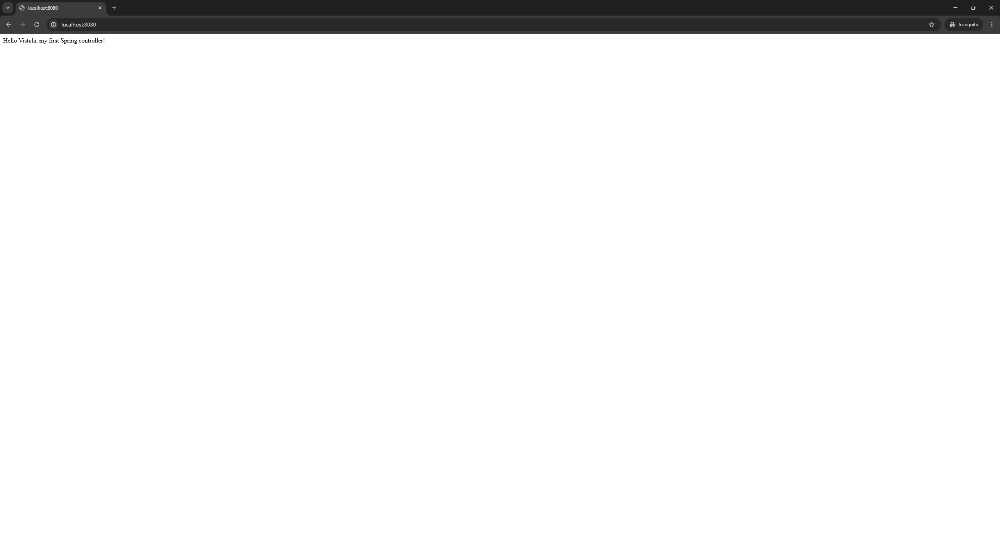
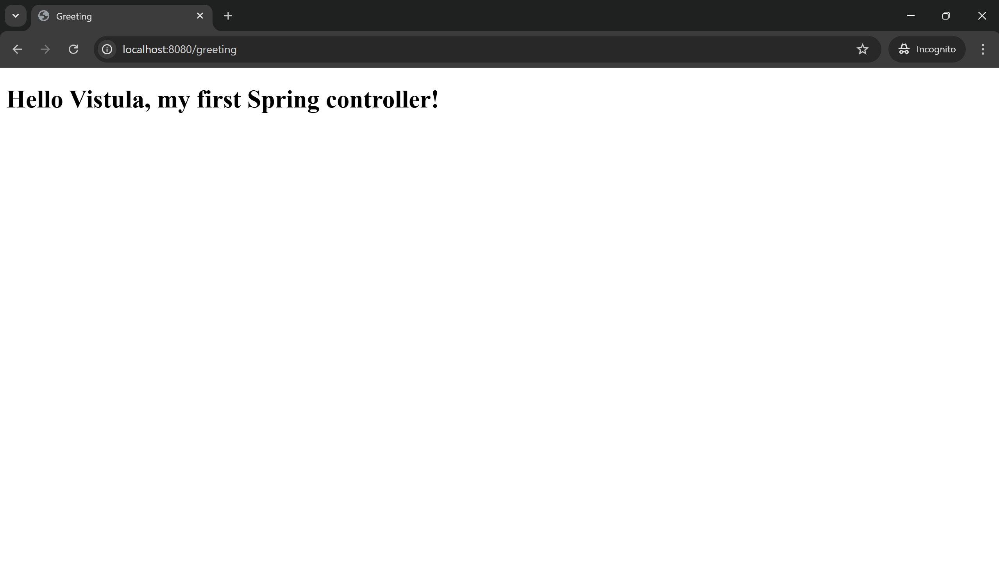

# Task 1 – Spring Boot MVC Application

This project was created as part of **Task 1** for the *Spring Framework Apps* course at **Akademia Finansów i Biznesu Vistula**.

The goal of this task was to create a simple Spring Boot application, implement a first Spring controller, handle HTTP requests using `@ResponseBody`, and extend the application using the MVC design pattern with Thymeleaf.

---

## Technologies Used
- Java 17
- Spring Boot
- Spring Web
- Thymeleaf
- Maven
- IntelliJ IDEA

---

## Application Description
The application demonstrates basic usage of the Spring Framework by handling HTTP GET requests and returning both plain text responses and HTML views.

The application runs on an embedded Tomcat server on port **8080**.

---

## Use Cases

### Use Case 1: Display a simple text response
**Description:**  
The user sends an HTTP GET request to the root endpoint of the application.  
The application returns a simple text message directly in the browser.

- **HTTP Method:** GET  
- **Endpoint:** `/`  
- **Response:**
  
Hello Vistula, my first Spring controller!

This use case demonstrates the usage of `@ResponseBody` in a Spring controller.

📸 **Screenshot:**  

---

### Use Case 2: Display an HTML page using MVC
**Description:**  
The user sends an HTTP GET request to the `/greeting` endpoint.  
The application returns an HTML page rendered using Thymeleaf.

- **HTTP Method:** GET  
- **Endpoint:** `/greeting`  

The controller passes data to the view using the `Model` object, and the HTML page displays the greeting message.

📸 **Screenshot:**  

---

## How to Run the Application
1. Open the project in **IntelliJ IDEA**
2. Run the `Task1Application` class
3. Open a browser and go to:
   - `http://localhost:8080`
   - `http://localhost:8080/greeting`

---

## Conclusion
Task 1 was completed successfully.  
The application handles HTTP requests correctly and demonstrates both a simple controller response and the MVC pattern using Thymeleaf.

